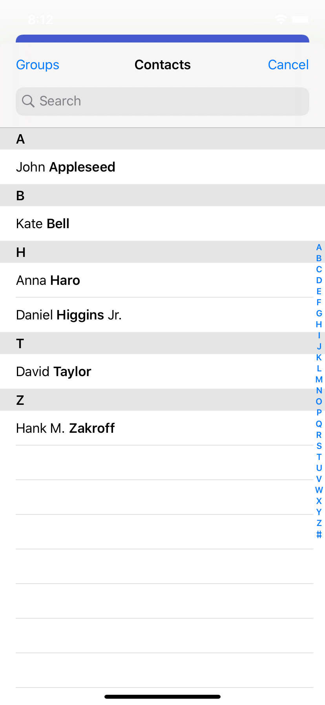

# nativescript-contacts-chooser




## Installation

Describe your plugin installation steps. Ideally it would be something like:

```javascript
tns plugin add nativescript-contacts-chooser
```

## Usage 

Describe any usage specifics for your plugin. Give examples for Android, iOS, Angular if needed. See [nativescript-drop-down](https://www.npmjs.com/package/nativescript-drop-down) for example.
	
```javascript
import { ContactsChooser, ContactsChooserResult } from 'nativescript-contacts-chooser';

//Request for permission (Android)
chooser.requestPermission();

//Choose contact
chooser.open()
    .then((contact: ContactsChooserResult) => {
        console.log(contact);
    })
```

## API

Describe your plugin methods and properties here. See [nativescript-feedback](https://github.com/EddyVerbruggen/nativescript-feedback) for example.
    
| Property | Description |
| --- | --- |
| requestPermission() |  Request for permission to access contacts |
| open() | Open contacts picker
    
## License

Apache License Version 2.0, January 2004
